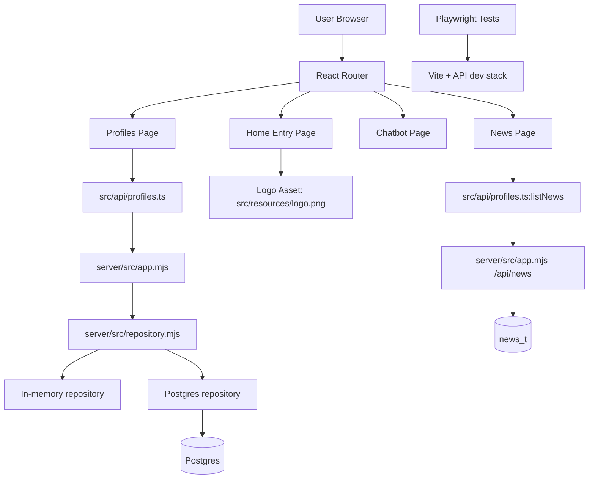

# Implementation

## Table of Contents

- [Implementation](#implementation)
  - [Table of Contents](#table-of-contents)
  - [Architecture Overview](#architecture-overview)
  - [Key Components](#key-components)
    - [App Shell](#app-shell)
    - [News Scraper API](#news-scraper-api)
    - [Entry Page (Home)](#entry-page-home)
    - [Profiles Page](#profiles-page)
    - [Chatbot Page](#chatbot-page)
    - [News Page](#news-page)
    - [Bootstrap and Routing](#bootstrap-and-routing)
    - [Styling](#styling)
  - [Data Flow](#data-flow)
  - [Observability and Trace Context](#observability-and-trace-context)
  - [Design Decisions and Trade-offs](#design-decisions-and-trade-offs)
  - [Security Notes](#security-notes)

## Architecture Overview

The project is a React + TypeScript single-page application built with Vite and a small Node API layer for profile persistence.

## Key Components

### App Shell

- File: `src/App.tsx`
- Provides the top navigation and route declarations.
- Defines the route map:
  - `/`
  - `/profiles`
  - `/chatbot`
  - `/news`
  - fallback route to `/`

### News Scraper API

- Files:
  - `server/src/index.mjs`
  - `server/src/app.mjs`
  - `server/src/repository.mjs`
  - `server/src/postgres-repository.mjs`
  - `server/src/memory-repository.mjs`
- Exposes CRUD endpoints under `/api/profiles`.
- Exposes News endpoints under `/api/news`.
- Uses request validation before mutating state or database rows.
- Selects Postgres storage when `PROFILE_STORE=postgres` or database env vars are present.
- Falls back to an in-memory repository when Postgres is not configured, which keeps local UI development and tests runnable without a database.

### Entry Page (Home)

- File: `src/App.tsx` (`Home` component)
- Presents the News Scraper entry section.
- Uses the current logo asset from `src/resources/logo.png`.
- Shows menu cards for Profiles, Chatbot, and News.

### Profiles Page

- File: `src/App.tsx` (`ProfilesPage` component)
- Provides profile management backed by the profile API.
- Supports one or more profiles.
- Each profile includes:
  - Required name
  - Optional description
  - `useCustomSources` flag to switch between AI-recommended and user-defined sources
  - Optional tag chips with per-profile uniqueness enforcement
  - Optional role chips (for example: Engineer, Architect, CIO, CTO) with per-profile uniqueness enforcement
  - URL source entries with required URL when custom mode is enabled
  - RSS feed entries with required feed URL when custom mode is enabled
- Add profile uses a dialog-based workflow.
- Existing profiles are listed in compact rows with name and edit/delete actions.
- URLS, RSS, TAGS, and ROLES editing are separated through tabs.
- URLS and RSS tabs include a shared `Custom` checkbox; when unchecked, source editors are hidden and AI-recommended sources are used.
- Disabling Custom mode after entering URL/RSS content asks for explicit confirmation and clears existing custom source entries if confirmed.

### Profile Context Selector

- File: `src/App.tsx` (`App` component)
- Loads available profiles once at root level.
- Provides a global profile selector in the top bar.
- Selected profile is passed into Chatbot and News pages to scope displayed context.

### Chatbot Page

- File: `src/App.tsx` (`ChatbotPage` component)
- Provides profile-scoped chat interaction against collected news.
- Uses:
  - `src/api/chatbot.ts`
  - `POST /api/chats/dispatch` for synchronous UI responses
  - `GET /api/profiles/:id/chat-history` for history screen data
- Uses `POST /api/chats` as a separate persistent integration endpoint (not the default Chat UI submit flow).
- Displays chat history per profile via backend endpoints.
- `chats_t` is treated as an n8n integration persistence table; the UI does not read or write this table directly.
- Shows backend trace id on failures for correlation with logs.

### News Page

- File: `src/App.tsx` (`NewsPage` component)
- Displays a table-like layout with:
  - Title
  - Summary
  - Origin
  - Timestamp
  - Link
- Retrieves profile-scoped news from `/api/news?profileId=<id>`.
- Supports:
  - Auto-refresh every 5 minutes (default enabled)
  - Manual refresh via a button
  - Last refresh indicator
  - Keyword filtering on title and summary
  - Favorites-only filtering
  - Role-based relevance filtering when the active profile has roles configured
  - Favorite state persistence via `PUT /api/news/{id}/favorite`

### Bootstrap and Routing

- File: `src/main.tsx`
- Mounts React application into the DOM.
- Wraps the app in `BrowserRouter`.

### Styling

- Files:
  - `src/index.css`
  - `src/App.css`
- Implements a dark theme visual design with responsive behavior.

### Database Schema

- File: `server/sql/init.sql`
- Creates:
  - `profiles_t`
  - `profile_roles_t`
  - `profile_tags_t`
  - `profile_urls_t`
  - `rss_feeds_t`
  - `news_t`
  - `chats_t`
- Stores custom source mode in `profiles_t.use_custom_sources`.
- Stores the latest full normalized profile payload in `profiles_t.json` so row-level profile metadata keeps a JSON snapshot alongside the relational child tables.
- During Postgres schema initialization, existing rows with a null `profiles_t.json` value are backfilled from the relational tag, URL, and RSS tables.
- Stores the latest normalized notification channel payload in `notification_channels_t.json` so each email/slack channel row keeps a JSON snapshot of channel configuration.
- During Postgres schema initialization, existing rows with a null `notification_channels_t.json` value are backfilled from `channel_type`, `email_addresses`, and `slack_webhook_url`.
- Uses standardized timestamp column names:
  - `created_ts`
  - `updated_ts`
- Uses `ON DELETE CASCADE` so child URL rows are removed automatically when a profile is deleted.
- `chats_t` is used for chatbot workflow integration storage (n8n-facing persistence) and is not accessed directly from browser UI code.

## Data Flow

1. Application starts from `index.html`, loading `src/main.tsx`.
2. `main.tsx` renders `App` inside `BrowserRouter`.
3. Route selection determines which page component is rendered.
4. Root app state loads profiles from `/api/profiles` and exposes an active profile selector.
5. The Profiles page opens add flow in a dialog, and uses inline editing for existing rows.
6. Create and update actions send validated payloads with custom source mode, tags, roles, URL, and RSS arrays to the API.
7. If custom mode is disabled, URL and RSS arrays are stored empty and AI-recommended sources are assumed.
8. The repository stores profile rows, tag rows, URL rows, and RSS feed rows either in memory or in Postgres.
9. On every Postgres profile create and update, the repository also writes the complete normalized profile payload into `profiles_t.json`.
10. On every Postgres notification profile create and update, the repository writes each normalized channel payload into `notification_channels_t.json`.
11. During Postgres startup initialization, any pre-existing profiles or notification channels missing JSON snapshots are backfilled once from stored relational fields.
12. The API returns normalized profile objects to the browser, which updates root selector context immediately.
13. Delete removes the selected profile through the API and then removes it from the rendered list.
14. Chatbot and News views read the currently selected profile context from root state.
15. Chatbot UI submits a question to `/api/chats/dispatch`; backend triggers n8n via webhook and returns synchronous answer payload for immediate rendering.
16. Persistent chatbot integration remains available via `/api/chats`, which writes workflow message rows in `chats_t`.
17. Chatbot history is loaded from `/api/profiles/:id/chat-history`; UI interaction remains API-based and does not directly access `chats_t`.
18. The News page requests profile-scoped rows from `/api/news`; the backend returns all rows for the selected profile without role-based filtering.
19. News filtering is applied client-side against title and summary, with optional favorites-only filtering.
20. Favorite toggles are persisted through `PUT /api/news/{id}/favorite` and reflected immediately in rendered rows.
21. External article links open in a new tab with `rel="noreferrer"`.

## Observability and Trace Context

- Files:
  - `src/api/profiles.ts`
  - `src/App.tsx`
  - `server/src/app.mjs`
  - `server/src/index.mjs`
  - `server/src/otel.mjs`
  - `observability/otel-collector-config.yaml`
- Client-side API requests emit a W3C `traceparent` header for each profile API call.
- Backend middleware parses incoming `traceparent` and reuses the incoming `traceId` when valid.
- Backend startup enables OpenTelemetry auto-instrumentation when OTLP endpoint configuration is present.
- Backend exports traces over OTLP HTTP for collector or direct Grafana ingestion.
- Collector config receives OTLP traces and forwards them to Grafana OTLP endpoint with Basic auth.
- Backend terminal logging is always enabled and remains the primary local output, even when OTEL is disabled or export targets are unavailable.
- Grafana integration acts as an optional additional exporter layer and does not replace terminal logs.
- Backend emits structured JSON logs including:
  - `trace_id`
  - `span_id`
  - `parent_span_id`
  - `http_method`
  - `http_route`
  - `http_status_code`
  - `duration_ms`
- Error responses include `traceId` in JSON payloads so users and operators can correlate UI failures with backend log lines.
- UI error messages append `Trace ID: <value>` when provided by backend/API client.

## Design Decisions and Trade-offs

- The profile API uses a repository abstraction so the browser flow can be tested without requiring a live Postgres instance.
- Postgres schema initialization is executed automatically at API startup to reduce local setup friction.
- The Vite dev server proxies `/api` requests to the backend, which keeps browser code free of hardcoded hostnames.
- React Router was selected to keep page concerns separated while preserving SPA behavior.
- Dark visual schema is used to align with project implementation guidance.
- Playwright is configured to start the app automatically during end-to-end test execution.

Trade-offs:

- The frontend build is still separate from backend deployment packaging.
- Memory fallback is convenient for development but should not be used in production when durable profile storage is required.
- News retrieval is API-backed, but scraper ingestion/population of `news_t` is still outside this implementation.

## Security Notes

Current implementation avoids sensitive-data handling and authentication workflows.

Applied secure defaults:

- No secrets hardcoded in source files.
- Database credentials are loaded from environment variables rather than frontend code.
- External links use `target="_blank"` with `rel="noreferrer"`.
- No dynamic HTML injection (`dangerouslySetInnerHTML`) is used.
