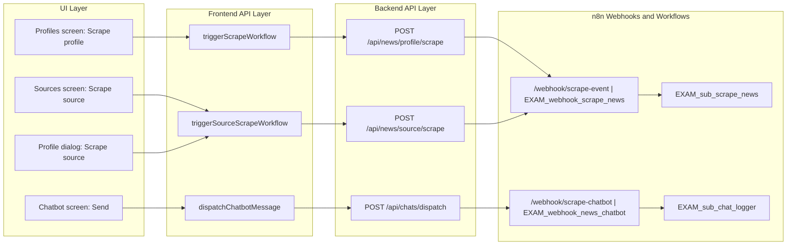
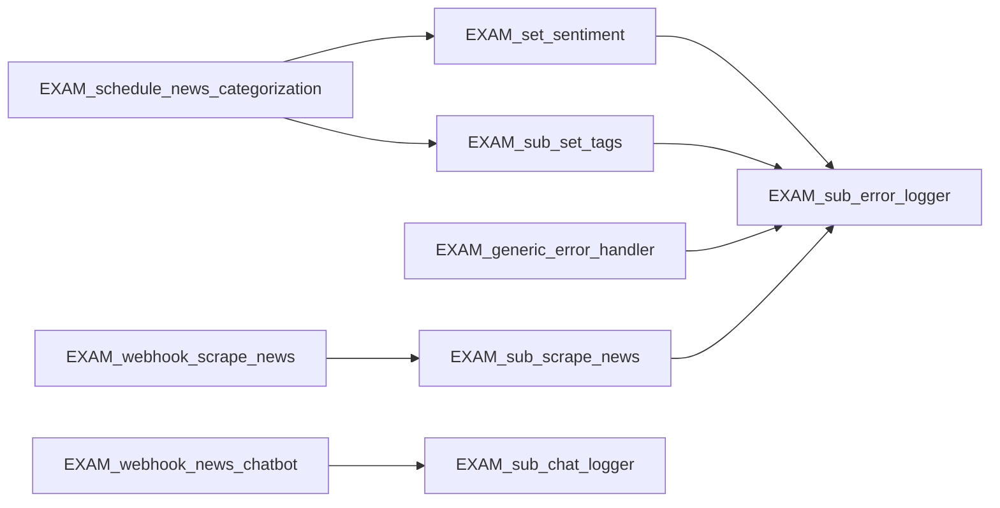

# n8n Workflow Documentation

## Table of Contents

- [n8n Workflow Documentation](#n8n-workflow-documentation)
  - [Table of Contents](#table-of-contents)
  - [Overview](#overview)
  - [Excluded Workflows](#excluded-workflows)
  - [UI to API to n8n Mapping](#ui-to-api-to-n8n-mapping)
  - [UI/API Integration Diagram](#uiapi-integration-diagram)
  - [Workflow Inventory](#workflow-inventory)
  - [High-Level Workflow Dependencies](#high-level-workflow-dependencies)
  - [Flow Notes](#flow-notes)

## Overview

This document summarizes all exported workflows found in `/n8n` and describes their triggers, purpose, and cross-workflow dependencies.

Total exported workflows found in `/n8n`: **19**.

Total workflows documented in this file: **18**.

## Excluded Workflows

The following workflows are intentionally excluded from this documentation scope:

- `EXAM_news_chatbot` (`7khY7GoMkBKWNeJY-EXAM_news_chatbot.json`)

Rule for future updates: keep this workflow excluded from inventory, dependency diagrams, and notes unless scope changes explicitly.

## UI to API to n8n Mapping

This section connects UI buttons to frontend API calls, backend API endpoints, and the n8n webhook workflows they trigger.

| UI Screen | Button / User Action | Frontend Function | Backend API Endpoint | n8n Webhook Endpoint | n8n Workflow Path |
|---|---|---|---|---|---|
| Profiles -> Profiles tab | `Scrape profile` | `triggerScrapeWorkflow(profile.id, profile.name)` | `POST /api/news/profile/scrape` | `POST /webhook/scrape-event` (configured via `SCRAPE_WEB_WEBHOOK_URL` / `SCRAPE_WEBHOOK_URL`) | `EXAM_webhook_scrape_news` -> `EXAM_sub_scrape_news` -> DB inserts/errors |
| Profiles -> Sources tab | `Scrape source` | `triggerSourceScrapeWorkflow(source.id)` | `POST /api/news/source/scrape` | `POST /webhook/scrape-event` (configured via `SCRAPE_WEB_WEBHOOK_URL` / `SCRAPE_WEBHOOK_URL`) | `EXAM_webhook_scrape_news` -> `EXAM_sub_scrape_news` -> DB inserts/errors |
| Profile dialog (create mode) -> SOURCE section | `Scrape source` | `triggerSourceScrapeWorkflow(draft.sourceId)` | `POST /api/news/source/scrape` | `POST /webhook/scrape-event` (configured via `SCRAPE_WEB_WEBHOOK_URL` / `SCRAPE_WEBHOOK_URL`) | `EXAM_webhook_scrape_news` -> `EXAM_sub_scrape_news` -> DB inserts/errors |
| Chatbot screen | `Send` (submit message) | `dispatchChatbotMessage({ profileId, sessionId, message })` | `POST /api/chats/dispatch` | `POST /webhook/scrape-chatbot` (configured via `SCRAPE_CHATBOT_WEBHOOK_URL`) | `EXAM_webhook_news_chatbot` -> `EXAM_sub_chat_logger` |

Non-webhook UI actions (for clarity):

- Chat History `Refresh` button calls `GET /api/profiles/:id/chat-history` and reads persisted data from the backend/repository only (no direct n8n webhook trigger).
- News page `Refresh` and favorite toggle actions call backend REST endpoints (`GET /api/news`, `PUT /api/news/:id/favorite`) and do not directly invoke n8n.

## UI/API Integration Diagram

## Workflow Inventory

| File | Workflow Name | Trigger Type | Entry Point | Calls Other Workflows | Primary Purpose |
|---|---|---|---|---|---|
| `89el4jc8Qd4CwFyL-EXAM_sub_set_tags.json` | EXAM_sub_set_tags | Execute Workflow Trigger | Sub-workflow only | `EXAM_sub_error_logger` | AI-assisted tag extraction and persistence for news items. |
| `9vKV1a39erm7VNRn-EXAM_generic_error_handler.json` | EXAM_generic_error_handler | Error Trigger | Global workflow error trigger | `EXAM_sub_error_logger` | Captures workflow errors and forwards enriched error payload to error logger subflow. |
| `c0joQmLrBerWk8W6-EXAM_schedule_news_categorization.json` | EXAM_schedule_news_categorization | Schedule Trigger | Scheduled | `EXAM_set_sentiment`, `EXAM_set_tags` | Batch categorization pipeline for new or stuck news rows. |
| `dsGBWJAnjZm6MK2a-EXAM_webhook_news_letter.json` | EXAM_webhook_news_letter | Webhook | `POST /webhook/news` | None | Fetches news, aggregates counts, and generates chart output (QuickChart). |
| `eIr1nxwNqQcoqiaa-EXAM_schedule_news_rag_vector_store.json` | EXAM_schedule_news_rag_vector_store | Schedule Trigger | Scheduled | None | Embedding and vector-store ingestion pipeline for news (OpenAI + Pinecone style flow). |
| `fYjmBAn9hIAxAra3-EXAM_schedule_init_tags.json` | EXAM_schedule_init_tags | Schedule Trigger | Scheduled | None | Periodically fetches/creates initial taxonomy tags via AI agent. |
| `H0Mo5FaBUpn0b6ot-EXAM_chatbot_error_handler.json` | EXAM_chatbot_error_handler | Error Trigger | Workflow error trigger + webhook response | None | Chatbot-specific error responder that returns webhook error payloads. |
| `JEbisWFlcn6mDvxe-EXAM_sub_scrape_news.json` | EXAM_sub_scrape_news | Execute Workflow Trigger | Sub-workflow only | `EXAM_sub_error_logger` | RSS/OPML scrape subflow, computes deterministic IDs, and inserts news. |
| `jni0fwcwEkZ668Ks-Daily_Digest.json` | Daily Digest | Schedule Trigger | Scheduled | None | Digest/reporting workflow combining RSS/news lists and exporting data (CSV/upload/analyze path). |
| `kJ5w9hCRY9fjqtTY-EXAM_sub_chat_logger.json` | EXAM_sub_chat_logger | Execute Workflow Trigger | Sub-workflow only | None | Persists chatbot interaction logs. |
| `Mj2AF0GLHCo2YL9X-EXAM_webhook_scrape_profile.json` | EXAM_webhook_scrape_profile | Webhook | `POST /webhook/scrape-web-news` | None | Scrapes paged web-news results and inserts normalized news rows. |
| `mZ2ZpXpWkcJrpsKS-EXAM_sub_error_logger.json` | EXAM_sub_error_logger | Execute Workflow Trigger | Sub-workflow only | None | Centralized error logging subflow with optional context merge and DB insert. |
| `n1sXruyKoexY46OI-EXAM_webhook_chat_logger.json` | EXAM_webhook_chat_logger | Webhook | `POST /webhook/chat-logger` | None | Webhook endpoint that inserts chat logs directly. |
| `SakuwaMRQ7M4Eq3q-DEMO_quickchart.json` | DEMO_quickchart | Manual Trigger | Manual test run | None | Standalone QuickChart demo and upload flow. |
| `ThLgC66d8JZJO6AZ-EXAM_webhook_scrape_news.json` | EXAM_webhook_scrape_news | Webhook | `POST /webhook/scrape-event` | `EXAM_sub_scrape_news` | Entry webhook for scrape events; enriches context and delegates scrape-to-DB work. |
| `tSA7PDFcRMLISMTC-EXAM_set_sentiment.json` | EXAM_set_sentiment | Execute Workflow Trigger | Sub-workflow only | `EXAM_sub_error_logger` | Sentiment analysis subflow with model inference and DB update. |
| `w3QApKj6VaTMc1Bt-Global_Error_Handler.json` | Global Error Handler | None (empty export) | N/A | None | Placeholder/empty workflow export (no nodes). |
| `W41shBsdGcuJSa3L-EXAM_webhook_news_chatbot.json` | EXAM_webhook_news_chatbot | Webhook | `POST /webhook/scrape-chatbot` | `EXAM_sub_chat_logger` | Chatbot webhook orchestration variant; validates input, runs AI agent, logs chat, and responds. |

## High-Level Workflow Dependencies

The diagram below shows only workflow-to-workflow calls (Execute Workflow nodes), not intra-workflow node links.

## Flow Notes

1. Chatbot orchestration is represented by `EXAM_webhook_news_chatbot`, which exposes `scrape-chatbot` and calls `EXAM_sub_chat_logger`.
2. Error logging is centralized in `EXAM_sub_error_logger` and is reused by categorization/sentiment/tagging and scrape subflows.
3. `Global Error Handler` export currently contains no nodes and appears to be a stub.
4. Several workflows are fully standalone (no Execute Workflow dependency), primarily webhook entrypoints, scheduled jobs, and demos.
5. Some exported Execute Workflow node IDs differ from local file IDs, but cached workflow names resolve to local flows (common when importing/exporting across n8n instances).
