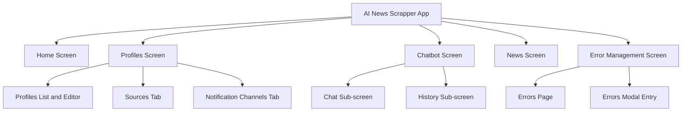

# Main Screen Requirements

## Table of Contents

- [Main Screen Requirements](#main-screen-requirements)
  - [Table of Contents](#table-of-contents)
  - [Purpose](#purpose)
  - [Screen and Sub-screen Map](#screen-and-sub-screen-map)
  - [Requirement Document Mapping](#requirement-document-mapping)
  - [Cross-Screen Functional Requirements](#cross-screen-functional-requirements)
  - [Cross-Screen Non-Functional Requirements](#cross-screen-non-functional-requirements)
  - [Acceptance Criteria](#acceptance-criteria)

## Purpose

Define the top-level screen structure of the application and map each main screen area to its detailed requirement documents.

## Screen and Sub-screen Map

## Requirement Document Mapping

1. Profiles screen and profile editor behavior: `requirements/profiles-requirements.md`
2. Notification channels behavior: `requirements/notification-channels-requirements.md`
3. Chatbot parent behavior: `requirements/chatbot-requirements.md`
4. Chatbot chat sub-screen behavior: `requirements/chatbot-chat-requirements.md`
5. Chatbot history sub-screen behavior: `requirements/chatbot-history-requirements.md`
6. News search behavior: `requirements/news-search-requirements.md`
7. Error management behavior: `requirements/error-management-requirements.md`

## Cross-Screen Functional Requirements

1. Home screen must provide navigation entry points to Profiles, Chatbot, and News.
2. Profiles selection context must be shared with Chatbot and News flows.
3. Chatbot screen must keep chat and history requirements split into dedicated sub-screen documents.
4. Error handling flows must preserve trace ID visibility so users can correlate UI failures with backend logs.
5. Documentation for main and sub-screens must stay synchronized with implemented routes and behavior.

## Cross-Screen Non-Functional Requirements

1. UI text must be in English.
2. Main and sub-screen behavior must remain usable on desktop and mobile form factors.
3. Structured logging and trace context propagation must remain consistent across API-backed screen flows.
4. Requirement markdown files must keep table of contents sections up to date.

## Acceptance Criteria

1. A root requirements document exists at `requirements/main-screen-requirements.md`.
2. The document includes a Mermaid diagram showing main screens and sub-screens.
3. Every implemented screen domain maps to at least one detailed requirement document.
4. Links and references in this document remain aligned with existing files in `requirements/`.
